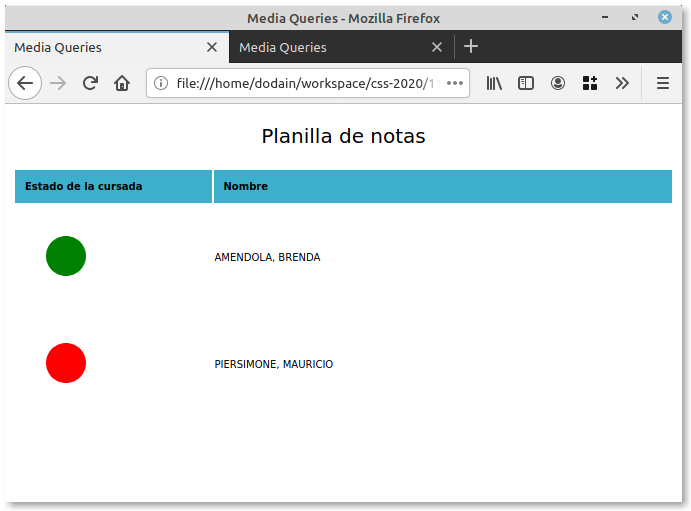
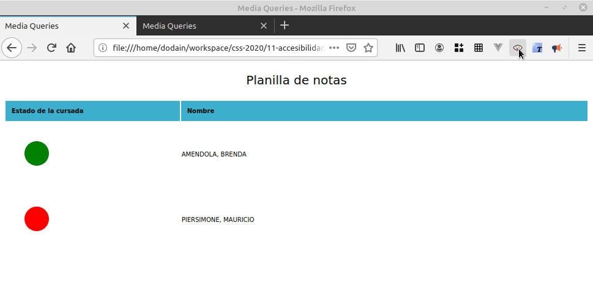
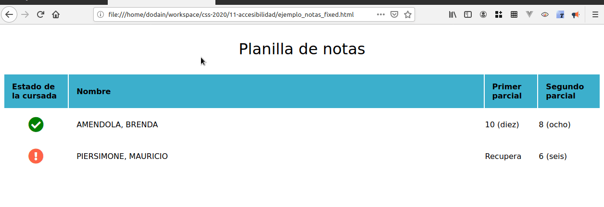
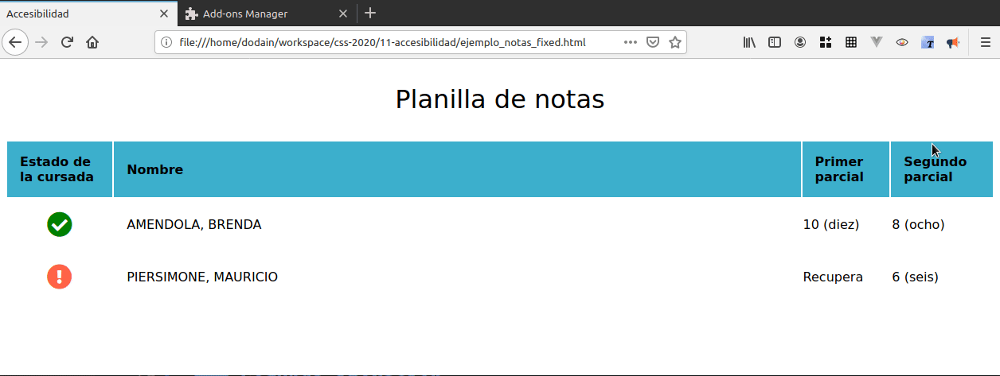

## Atributos de calidad de una página web

Si les preguntamos qué debe tener una página web, podemos nombrar varios atributos de calidad importantes:

- que sea performante,
- que estéticamente sea agradable, en cuanto a disposición espacial, elección de colores y tipografías, la organización jerárquica de lo importante y lo periférico,
- que sea "usable", que ofrezca una buena "user experience" -> sería bueno tener en cuenta quién accederá a nuestra página y qué cuestiones de accesibilidad necesitamos resolver

## Accesibilidad

La cita de Manuel Matuzovic es una gran introducción para hablar de accesibilidad:

> _"Accessibility is something that concerns all of us, you and me, every day. What we create is useless if it isn’t accessible."_

## Primer ejemplo: notas

### Versión original

Como muestra, vamos a ver la página `ejemplo_notas.html`, que simula una planilla de notas de una materia:



Vean que el tamaño de la letra no parece ser suficientemente grande: en un mundo donde [el 61% de las personas en Holanda, y más de 4.000.000.000 de personas en el mundo usamos anteojos o lentes de contacto](https://www.cbs.nl/en-gb/news/2013/38/more-than-6-in-10-people-wear-glasses-or-contact-lenses#:~:text=More%20and%20more%20people%20wear,wear%20glasses%20or%20contact%20lenses.), no parece ser una decisión que favorezca la accesibilidad.

Y si descargamos el Add-on [Let's get color blind](https://addons.mozilla.org/es/firefox/addon/let-s-get-color-blind/) de Firefox, podremos ver cómo perciben la misma página personas con deuteranopia y otros tipos de daltonismo:



Ahora vemos que no es para nada fácil discriminar el color cuando el status es "está todo ok", o "tenés que recuperar algo". Se calcula un [8% de personas con daltonismo en el mundo](http://www.colourblindawareness.org/colour-blindness/), es muy probable entonces que la usabilidad de nuestra página se vea afectada.

Pero más allá de todo, la página no está mostrando suficiente información.

### Primera iteración

En el archivo `ejemplo_notas_fixed.html` hicimos algunos cambios:

- el font-size es mayor. Si bien podemos hacer zoom, no todos conocen el truco de "la ruedita del mouse" y mucha menos gente utiliza el _shortcut_ `Ctrl` + `+`
- tenemos una columna que muestra directamente las notas, sin necesidad de abrir una ventana emergente o tooltip. Eso nos permite recordar más fácilmente más información.
- en lugar de tener solamente colores, utilizamos íconos de [Font Awesome](https://github.com/FortAwesome/Font-Awesome): el check para lo que está ok, y la cruz para indicar que hay que recuperar. Entonces una persona daltónica puede procesar esa información mucho mejor.
- tenemos un tooltip asociado a la imagen, que nos permite aclarar mejor la situación: "promociona", o "debe recuperar para firmar la materia".



### Segunda iteración

¿Cómo perciben la página las personas no-videntes? Podemos verlo instalando otro add-on, en este caso [Read Aloud](https://addons.mozilla.org/en-US/firefox/addon/read-aloud/versions/?src=hotness) (también hay una versión para Chrome). Cuando lo activamos, escucharemos la lista de notas:



En la primera variante vemos que solamente se lee la tabla, y se repite la nota en números y letras. Luego, activamos como add-on [HaTeMiLe for Browser](https://addons.mozilla.org/es/firefox/addon/hatemile-for-browser/), lo que permite detectar headers, titles y la descripción asociada a las imágenes, aunque vemos que hay mucha información redundante (escuchamos dos veces la nota: "ocho ocho", redundancia que no ocurre cuando presentamos la información en forma visual).

Las personas no-videntes suelen tener un software que los ayuda a interactuar con la máquina, llamado **screen reader**. Lo bueno es que la especificación W3 ya prevé tags específicos de accesibilidad que no afecta a los navegadores, sino a estos screen readers. De esa manera, podemos ocultar la nota duplicada mediante el tag `aria-hidden`:

```html
<td>
  <span aria-hidden="true">10</span>
  <span>(diez)</span>
</td>
```

Mientras que el navegador seguirá mostrando la misma información (no hay css asociado al span), el screen reader ignorará la nota numérica y solo leerá en voz alta el diez (podríamos haber elegido cualquiera de las dos opciones). Más abajo tienen el link de Accesibilidad para conocer la lista completa de tags `aria-` definidos por W3C.

## Resumen

Lograr que una página web sea usable requiere tener en cuenta las características de todas las personas que necesitarán utilizarla. Existe una técnica llamada [User Persona](https://medium.com/@andrewdjandrw/qu%C3%A9-es-un-user-persona-una-proto-persona-y-un-arquetipo-c4498c7f8836) que permite concentrarnos en entender qué es lo que busca nuestro cliente (en el ejemplo, se trata de alumnes de la facultad que están cursando), cuáles son sus motivaciones, sus expectativas, sus _pain points_ (los problemas que podrías estar resolviéndoles, como saber si tienen que recuperar o si pueden promocionar la materia), entre otros. A veces surgen perfiles dependiendo de la franja etaria, otros en base al vocabulario que manejan, o en la naturaleza del trabajo que realizan. [Lo que debemos tener en cuenta](https://blog.interactius.com/la-creaci%C3%B3n-de-user-personas-es-una-p%C3%A9rdida-de-tiempo-4e4f8473b5ee)) es que todo proceso de abstracción implica generalizar, y no debemos tomar el camino fácil de desestimar potenciales problemas de usabilidad para nuestras páginas. Parafraseando la frase inicial de Manuel Matuzovic, la accesibilidad no es una cuestión de estadística médica, tiene que ver con empatizar, con incluir, con acercar información a todes, y es el primer camino que vuelve una página útil.

## Material adicional

- [HTML: Una buena base para la accesibilidad](https://developer.mozilla.org/es/docs/Learn/Accessibility/HTML)
- [Writing HTML with Accessibility in Mind](https://medium.com/alistapart/writing-html-with-accessibility-in-mind-a62026493412)
- [Writing CSS with Accessibility in Mind](https://medium.com/@matuzo/writing-css-with-accessibility-in-mind-8514a0007939)
- [The A11Y Project](https://www.a11yproject.com/)
- [W3 Accessibility](https://www.w3.org/standards/webdesign/accessibility.html)
- [Modern CSS Techniques To Improve Legibility](https://www.smashingmagazine.com/2020/07/css-techniques-legibility/)